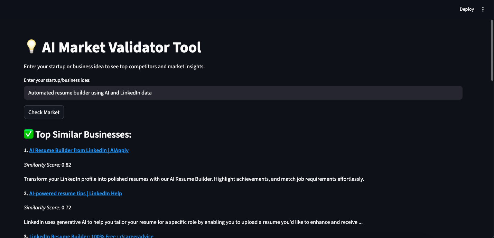
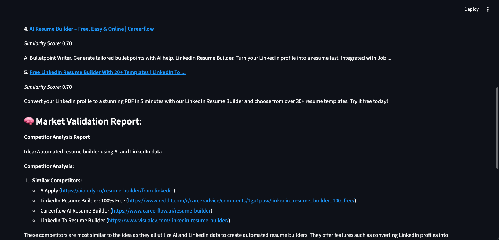
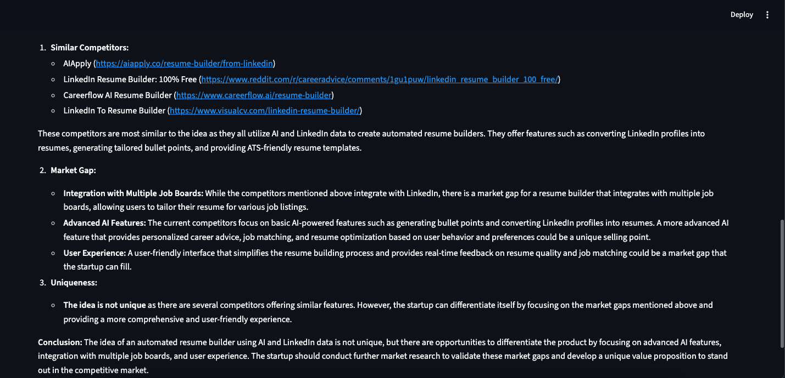

# 💡 AI Market Validator Tool

An AI-powered Streamlit web app that helps startup founders and entrepreneurs validate their business ideas by:

- Searching for existing competitors using **Google Custom Search**
- Measuring **semantic similarity** using **Sentence Transformers**
- Generating a concise **market analysis** report using **Groq's LLaMA 3.1 model**

---

## 🚀 Features

- 🔍 **Google Search Integration** – Finds similar businesses or ideas from across the web
- 🤖 **AI-Powered Analysis** – LLM analyzes competitors and provides market insights
- 📈 **Semantic Similarity Scoring** – Ranks businesses based on how close they are to your idea
- 🧠 **Market Gap Detection** – Highlights unique opportunities or crowded spaces

---

### ⚠️ **Future Enhancements Coming Soon:**  
- A separate document (`Future_Enhancements.md`) lists potential updates and improvements for the AI Market Validator Tool.  
- I will be actively working on these updates soon to make the tool more robust, accurate, and user-friendly.

---

## 🛠️ Tech Stack

- [Streamlit](https://streamlit.io/) – Web UI
- [Sentence-Transformers](https://www.sbert.net/) – Embeddings for similarity
- [Groq + LLaMA 3.1](https://groq.com/) – Language model for summarization
- [Google Custom Search API](https://programmablesearchengine.google.com/) – Web search

---

## 📸 Screenshots

| Idea Input                      | Competitor Results                  | Market Report                     |
| ------------------------------- | ----------------------------------- | --------------------------------- |
|  |  |  |

> 
---

## 🎬 Video Demo

Watch a quick demo of the AI Market Validator Tool in action:  
[Demo Video](Screenshots/Demo.mp4)

---

## 📦 Installation

1. **Clone the repository**
```bash
git clone https://github.com/itsaman080/Market_Validator.git
cd Market_Validator
````

2. **Create a virtual environment**

```bash
virtualenv env
source env/bin/activate
```

3. **Install dependencies**

```bash
pip install -r requirements.txt
```

4. **Set up environment variables**

Create a `.env` file in the root directory with the following:

```env
GOOGLE_API_KEY=your_google_api_key
GOOGLE_CSE_ID=your_custom_search_engine_id
GROQ_API_KEY=your_groq_api_key
```

---

## ▶️ Running the App

```bash
streamlit run market_validator.py
```

Then open your browser at: `http://localhost:8501`

---

## 🧪 Example Use Case

**Idea:** "AI Based Tutor"

**Output:**

* Shows similar businesses / Tools
* Analyzes which ones are closest
* Highlights gaps (e.g., lack of live-tracking in some markets)
* Gives verdict on idea uniqueness

---

## ⚠️ Notes & Limitations

* Google Custom Search API has **usage limits** and may require billing
* Short snippets may not fully represent competitor offerings
* Semantic similarity is based on text embeddings, not full business models
* LLM output may vary – not a substitute for in-depth market research

---

## 📄 License

MIT License

---

## 🙌 Acknowledgments

* [Google CSE](https://programmablesearchengine.google.com/)
* [Groq](https://groq.com/)
* [Hugging Face – Sentence Transformers](https://www.sbert.net/)
* [Streamlit](https://streamlit.io/)

---
